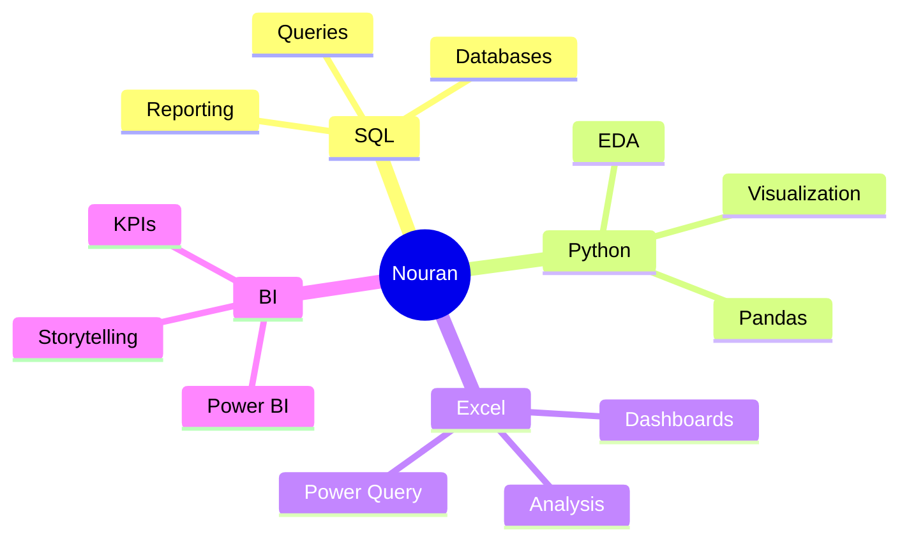
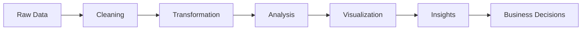
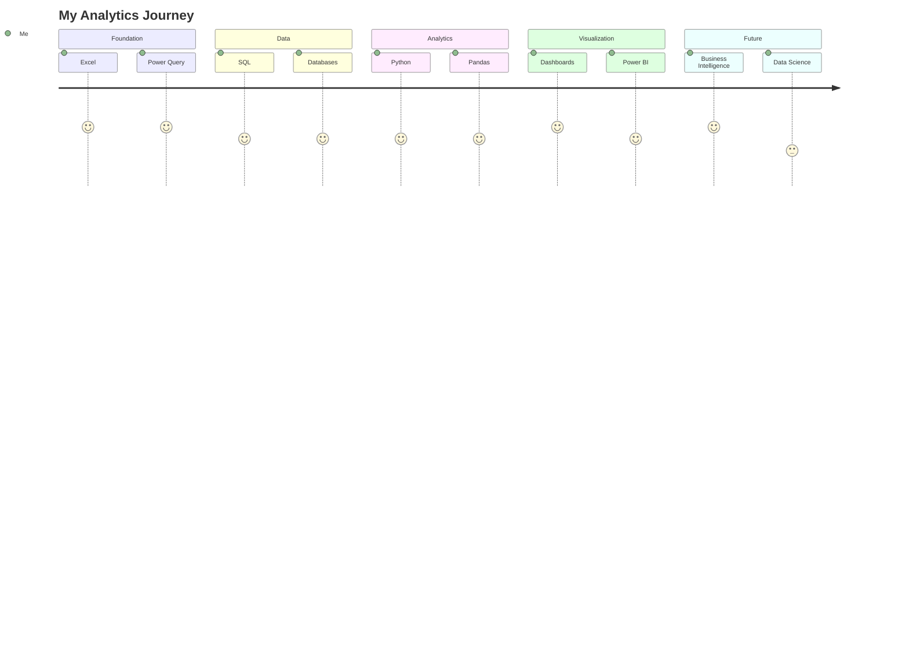

<div align="center">


<br>


</div>

---

# 🌌 Digital Identity

<div align="center">

```text
╔══════════════════════════════════════════════╗
║ Name      : Nouran Yasser                    ║
║ Role      : Data Analyst                     ║
║ Specialty : Business Intelligence            ║
║ Mission   : Data → Insights → Impact         ║
║ Status    : Building The Future 🚀           ║
╚══════════════════════════════════════════════╝
````

</div>

---

# ✨ About Me


### 👩‍💻 Hello, I'm Nouran Yasser

🎓 Computer Science Graduate

📊 Passionate about transforming raw data into actionable insights

📈 Interested in Business Intelligence, Analytics, Data Visualization and Reporting

💡 I enjoy discovering patterns, solving problems, and helping organizations make smarter decisions through data

🚀 Currently developing expertise in:

* SQL
* Python
* Excel
* Power BI
* Data Visualization
* Business Intelligence

🎯 Goal:

Become a highly skilled Data Analyst capable of building impactful analytics solutions that drive business growth.

---

# ⚡ System Boot

```bash
> Initializing NouranOS...

Loading SQL Engine .............. ████████████ 100%
Loading Excel Analytics ......... ████████████ 100%
Loading Python Core ............. ██████████░░ 90%
Loading Power BI Module ......... █████████░░░ 85%
Loading Analytics Engine ........ ████████████ 100%

Status: READY 🚀
```

---

# 🧬 Analytics DNA



---

# 🚀 Analytics Workflow



---

# 🛠️ Tech Arsenal

<div align="center">

### Analytics & BI


<br>

### Database Technologies


<br>

### Programming


<br>

### Tools


</div>

---

# 📊 Core Skills

| Category               | Skills                                   |
| ---------------------- | ---------------------------------------- |
| 📈 Data Analysis       | EDA, KPI Analysis, Business Insights     |
| 🧹 Data Preparation    | Cleaning, Wrangling, Transformation      |
| 📊 Visualization       | Dashboards, Reports, Storytelling        |
| 🗄️ Databases          | SQL Queries, Data Handling               |
| 🤝 Professional Skills | Teamwork, Communication, Problem Solving |

---

# 🌟 What I Bring

### 📊 Analytical Thinking

Ability to identify trends, patterns, and opportunities hidden within data.

### 🔍 Attention to Detail

Strong focus on data quality, accuracy, and reliability.

### 💡 Problem Solving

Transforming business challenges into data-driven solutions.

### 📈 Data Storytelling

Creating visual narratives that support decision making.

### 🚀 Continuous Learning

Always exploring new technologies and analytics techniques.

---

# 🎯 Current Focus

<div align="center">

| 🚀 Building        | 📚 Learning   | 🎯 Target             |
| ------------------ | ------------- | --------------------- |
| Analytics Projects | Advanced SQL  | Data Analyst Role     |
| Dashboards         | DAX           | Business Intelligence |
| Portfolio          | Data Modeling | Career Growth         |

</div>

---

# 🗺️ Learning Journey



---

# 🏆 Featured Projects

## 🏛️ KEMET – Egyptian Museums Management & Analytics Platform

A complete Business Intelligence solution for museum management and analytics.

### Highlights

* Database Design
* Data Warehouse
* ETL Pipelines
* SSIS
* SSRS Reports
* Power BI Dashboards
* KPI Tracking
* Business Insights
* Arabic & English Chatbot

---

## 📊 Power BI Dashboards

Interactive dashboards focused on:

* Revenue Analysis
* Customer Insights
* KPI Monitoring
* Trend Analysis
* Executive Reporting

---

## 🐍 Python Analytics Projects

Projects involving:

* Data Cleaning
* EDA
* Visualization
* Reporting

---

# 📈 GitHub Analytics

<div align="center">


</div>

<br>

<div align="center">


</div>

---

# 🏅 Achievement Gallery

<div align="center">


</div>

---

# 🌍 Activity Universe

<div align="center">


</div>

---

# 🐍 Contribution Snake

<div align="center">


</div>

---

# 🎯 2026 Mission Board

* [x] Build Analytics Portfolio
* [x] Learn SQL
* [x] Learn Python Analytics
* [x] Build Data Projects
* [x] Master Power BI
* [x] Build End-to-End BI Solutions
* [x] Land a Data Analyst Role

---

# 🌠 Professional Philosophy

> Data is not valuable because it exists.
>
> Data becomes valuable when it creates insights.
>
> Insights create decisions.
>
> Decisions create impact.

---

# 🌐 Connect With Me

<div align="center">

<a href="https://www.linkedin.com/in/nouran-yasser-582450280">

</a>

<br><br>

<a href="mailto:nourany743@gmail.com">

</a>

</div>

---

<div align="center">

## ✨ Favorite Quote

### "Data is the closest thing we have to a superpower."

<br>


### ⭐ Thanks for visiting my profile ⭐

</div>
```
