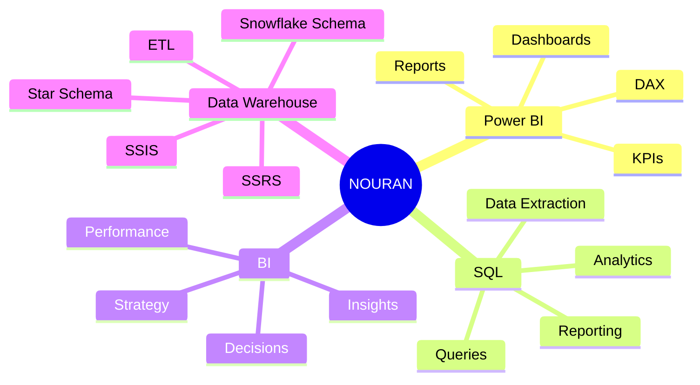
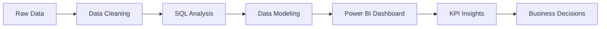
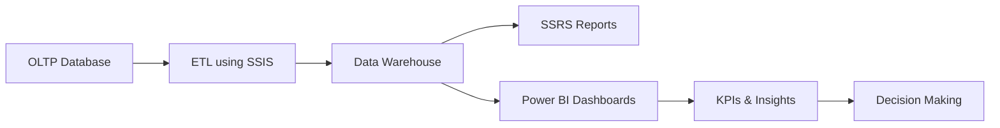

<div align="center">

# ⚡ N O U R A N . A N A L Y T I C S


<br>


</div>

---

# 🌌 ANALYTICS COMMAND CENTER

<table>
<tr>
<td width="50%">

### 🎯 CURRENT ROLE

```text
DATA ANALYST
````

### 📊 SPECIALIZATION

```text
POWER BI
SQL ANALYTICS
BUSINESS INTELLIGENCE
KPI REPORTING
```

### 🚀 STATUS

```text
OPEN TO OPPORTUNITIES
```

</td>

<td width="50%">

### ⚡ CURRENT MISSION

```text
Transforming Data
Into Business Value
```

### 🏆 TARGET

```text
BI ANALYST
POWER BI DEVELOPER
DATA ANALYST
```

</td>
</tr>
</table>

---

# 👩‍💻 ABOUT ME


### Hello, I'm Nouran Yasser

🎓 Computer Science Graduate
📊 Data Analyst focused on **Power BI, SQL, Business Intelligence, and KPI Reporting**
📈 Passionate about transforming raw data into clear dashboards, insights, and business decisions
💡 I enjoy building analytics solutions that help organizations understand performance and take action

### 🔥 Core Focus

* Power BI Dashboard Development
* SQL Data Analysis
* KPI Design & Reporting
* Business Intelligence
* Data Cleaning & Transformation
* Data Modeling
* Data Warehousing
* Executive Reporting
* Data Visualization
* Business Performance Analysis

---

# ⚡ BI SYSTEM BOOT

```bash
> Initializing Nouran Analytics Engine...

Loading Power BI Dashboards ......... ████████████ 100%
Loading SQL Analytics ............... ████████████ 100%
Loading Data Modeling ............... ███████████░ 95%
Loading DAX Measures ................ ██████████░░ 90%
Loading KPI Framework ............... ████████████ 100%
Loading Business Intelligence ....... ████████████ 100%

System Status: READY TO DELIVER INSIGHTS 🚀
```

---

# 🧠 ANALYTICS ECOSYSTEM



---

# 🚀 DATA TO DECISION PIPELINE



---

# 🛠️ TECHNOLOGY STACK

<div align="center">

## 📊 Business Intelligence & Analytics


<br><br>

## 🗄️ SQL & Data


<br><br>

## 🔄 ETL & Reporting


</div>

---

# 📊 CORE COMPETENCIES

| Domain                   | Expertise                                              |
| ------------------------ | ------------------------------------------------------ |
| 📊 Business Intelligence | Power BI, Dashboards, KPI Reporting                    |
| 🗄️ SQL Analytics        | SQL Server, Queries, Data Extraction                   |
| 🏗️ Data Modeling        | Star Schema, Snowflake Schema, Fact & Dimension Design |
| 🔄 ETL & Integration     | SSIS, Data Transformation, Data Loading                |
| 📋 Reporting             | SSRS, Executive Reports, Operational Reports           |
| 📈 Performance Analytics | KPIs, Trends, Business Insights                        |
| 🎨 Visualization         | Interactive Dashboards, Storytelling, Decision Support |

---

# 🏛️ FLAGSHIP PROJECT

## KEMET — Egyptian Museums Management & Analytics Platform

A complete Business Intelligence and Analytics platform designed to support museum management, reporting, performance tracking, and decision making.

---

## ⚡ BI ARCHITECTURE



---

## 🚀 KEY DELIVERABLES

<table>
<tr>
<td width="50%">

### 🗄️ Data Layer

* OLTP Database Design
* SQL Server Implementation
* Data Warehouse Design
* Galaxy Schema
* Snowflake Schema
* Fact & Dimension Tables

</td>

<td width="50%">

### 🔄 ETL & Reporting

* SSIS ETL Pipelines
* Data Cleaning
* Data Transformation
* SSRS Reports
* KPI Reporting
* Executive Insights

</td>
</tr>

<tr>
<td width="50%">

### 📊 Power BI

* Interactive Dashboards
* DAX Measures
* KPI Cards
* Drill-Down Analysis
* Navigation Buttons
* Business Insights

</td>

<td width="50%">

### 🤖 Analytics Chatbot

* Arabic & English Support
* Revenue Queries
* Visitor Insights
* Museum Performance Analysis
* Dashboard Navigation Help
* Real-Time Data Retrieval

</td>
</tr>
</table>

---

## 🧩 KEMET TECHNOLOGY STACK

<div align="center">


</div>

---

# 📊 POWER BI UNIVERSE

<div align="center">

### Executive Dashboards • Revenue Analytics • Visitor Insights • Performance Monitoring

</div>

```text
Power BI Dashboards
│
├── Executive Overview
├── Revenue Analysis
├── Visitor Segmentation
├── Museum Performance
├── Ticket Analysis
├── Event Analytics
├── Tour Analytics
├── Payment Behavior
├── Nationality Insights
└── Group Experience
```

---

# 🏗️ DATA WAREHOUSE UNIVERSE

```text
Museum_DWH
│
├── FactMuseumBooking
├── FactTourBooking
├── FactEventBooking
│
├── DimMuseum
├── DimVisitor
├── DimTicket
├── DimDate
├── DimTime
├── DimPayment
├── DimGuide
├── DimLanguage
└── DimPricing
```

---

# ⚡ ANALYTICS INTELLIGENCE CENTER

<div align="center">


</div>

<br>

<div align="center">


</div>

---

# 🌌 CONTRIBUTION MATRIX

<div align="center">


</div>

---

# 🏆 HALL OF LEGENDS

<div align="center">


</div>

---

# 🧠 ANALYTICS METRICS

<div align="center">


</div>

<br>

<div align="center">


</div>

---

# 🌟 2026 VISION & GOALS

## 🎯 Professional Development

* 🏆 Build a world-class BI & Data Analytics portfolio
* 📊 Create executive-level Power BI dashboards
* 🗄️ Master advanced SQL and query optimization
* 🧠 Improve DAX and KPI framework design
* 🏗️ Build end-to-end BI solutions
* 🔄 Strengthen ETL and Data Warehouse skills
* 📈 Deliver real-world business analytics projects

## 🚀 Career Objectives

* 💼 Secure a Data Analyst / BI Analyst position
* 📊 Deliver high-impact data-driven insights
* ⭐ Become a trusted business intelligence professional
* 🌍 Contribute to analytics and BI communities

---

# 🌠 ANALYTICS PHILOSOPHY

<div align="center">

## Data → Insights → Decisions → Impact

</div>

> Data is not valuable because it exists.
> Data becomes valuable when it creates insights.
> Insights create decisions.
> Decisions create impact.

---

# 🌐 CONNECT WITH ME

<div align="center">

<a href="https://www.linkedin.com/in/nouran-yasser-582450280">

</a>

<br><br>

<a href="mailto:nourany743@gmail.com">

</a>

</div>

---

<div align="center">

## ⚡ DATA NEVER SLEEPS

### Building BI Solutions That Transform Data Into Decisions


⭐ Thanks For Visiting My Profile ⭐

</div>
```
