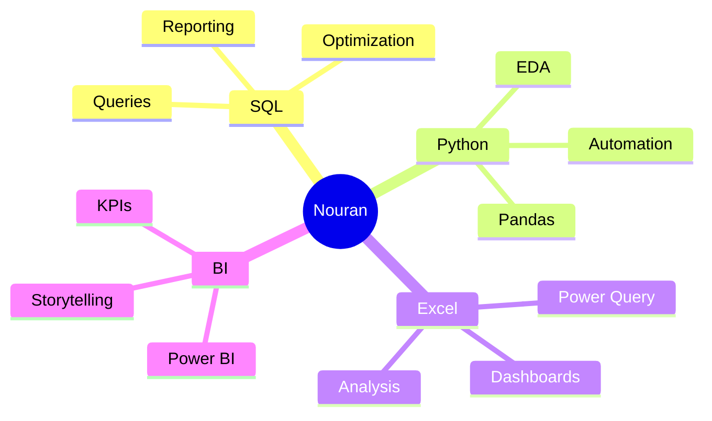
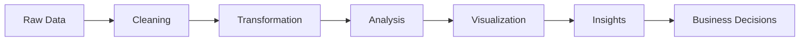

# 🌌 Welcome To My Analytics Universe

<div align="center">


<br>


</div>

---

# ⚡ Analytics Command Center

<div align="center">

```text
╔══════════════════════════════════════════════════════════╗
║ Name        : Nouran Yasser                             ║
║ Role        : Data Analyst                              ║
║ Focus       : Business Intelligence & Analytics         ║
║ Mission     : Transform Data Into Actionable Insights   ║
║ Status      : Building The Future 🚀                    ║
╚══════════════════════════════════════════════════════════╝
````

</div>

---

# 👩‍💻 About Me


### Hello, I'm Nouran Yasser

🎓 Computer Science Graduate

📊 Passionate about transforming complex data into meaningful business insights

📈 Interested in Analytics, Business Intelligence, Dashboard Design, Data Visualization, and Storytelling

💡 I enjoy solving real-world problems using data-driven approaches

🚀 Currently developing expertise in:

* SQL
* Python
* Excel
* Power BI
* Data Visualization
* Business Intelligence

🎯 Goal:

To become a highly skilled Data Analyst capable of building impactful analytics solutions that drive business growth and strategic decision-making.

---

# ⚙️ System Boot

```bash
> Initializing NouranOS...

Loading SQL Engine .............. ████████████ 100%
Loading Excel Analytics ......... ████████████ 100%
Loading Python Core ............. ██████████░░ 90%
Loading Power BI Module ......... █████████░░░ 85%
Loading Analytics Engine ........ ████████████ 100%

System Status: ONLINE ✅
```

---

# 🧬 Analytics DNA



---

# 🚀 Data Lifecycle



---

# 🚀 Technology Stack

<div align="center">

### Analytics & BI


<br><br>

### Database Technologies


<br><br>

### Programming


<br><br>

### Tools


</div>

---

# 📊 Core Competencies

| Area                    | Skills                                   |
| ----------------------- | ---------------------------------------- |
| 📈 Data Analysis        | EDA, KPI Analysis, Business Insights     |
| 🧹 Data Preparation     | Cleaning, Wrangling, Transformation      |
| 📊 Data Visualization   | Dashboards, Reports, Storytelling        |
| 🗄️ Database Management | SQL Queries, Data Handling               |
| 🤝 Professional Skills  | Teamwork, Communication, Problem Solving |

---

# 🎯 Current Focus

| 🚀 Building        | 📚 Learning   | 🎯 Target     |
| ------------------ | ------------- | ------------- |
| Analytics Projects | Advanced SQL  | Data Analyst  |
| Dashboards         | DAX           | BI Specialist |
| Portfolio          | Data Modeling | Career Growth |

---

# 🏆 Featured Projects

## 🏛️ KEMET — Egyptian Museums Management & Analytics Platform

### Key Contributions

* OLTP Database Design
* Data Warehouse Design
* ETL Pipelines using SSIS
* SSRS Reporting
* Power BI Dashboards
* KPI Monitoring
* Business Insights
* Arabic & English Analytics Chatbot

### Technologies

* SQL Server
* SSIS
* SSRS
* Power BI
* DAX
* Node.js
* Express.js
* GitHub

---

## 📊 Power BI Analytics Dashboards

* Revenue Analysis
* Customer Segmentation
* KPI Tracking
* Executive Reporting
* Business Performance Monitoring

---

## 🐍 Python Analytics Projects

* Data Cleaning
* Exploratory Data Analysis
* Data Visualization
* Reporting Automation

---

# ⚡ Analytics Intelligence Center

<div align="center">


</div>

<br>

<div align="center">


</div>

---

# 🌌 Contribution Matrix

<div align="center">


</div>

---

# 🏆 Hall Of Legends

<div align="center">


</div>

---

# 🧠 Analytics Metrics

<div align="center">


</div>

<br>

<div align="center">


</div>

---

# 🐍 Contribution Evolution

<div align="center">


</div>

---

# 🌟 2026 Vision & Goals

### Professional Development

* 🏆 Build a World-Class Analytics Portfolio
* 📊 Create Impactful Power BI Dashboards
* 🗄️ Master Advanced SQL & Data Modeling
* 🐍 Strengthen Python for Analytics & Automation
* 🏗️ Build End-to-End BI Solutions
* 📈 Deliver Real-World Analytics Projects
* 🌍 Contribute to Open Source

### Career Objectives

* 💼 Secure a Data Analyst / BI Analyst Position
* 📊 Deliver Data-Driven Insights
* 🚀 Grow Into a Business Intelligence Specialist

---

# 🌠 Professional Philosophy

> Data is not valuable because it exists.
>
> Data becomes valuable when it creates insights.
>
> Insights create decisions.
>
> Decisions create impact.

---

# 🌐 Connect With Me

<div align="center">

<a href="https://www.linkedin.com/in/nouran-yasser-582450280">

</a>

<br><br>

<a href="mailto:nourany743@gmail.com">

</a>

</div>

---

<div align="center">

## ⚡ Data Never Sleeps

### Building Analytics Solutions That Drive Decisions


⭐ Thanks For Visiting My Profile ⭐

</div>
```
