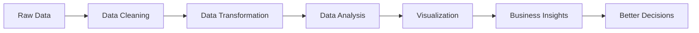

````md
<div align="center">


<br>


</div>

---

# ✨ About Me


### 👩‍💻 Hello, I'm **Nouran Yasser**

🎓 Recent **Computer Science Graduate** from **Mansoura University**

📊 Passionate about transforming raw, messy data into **clear insights, powerful dashboards, and smart business decisions**.

💡 I enjoy working with data through the full analytics journey:

```text
Raw Data → Cleaning → Transformation → Analysis → Visualization → Insights
````

🚀 Currently building strong skills in:

* SQL for data querying
* Excel dashboards and Power Query
* Python for analysis and visualization
* Power BI for business intelligence
* Data storytelling and reporting

🎯 My goal is to become a professional **Data Analyst** who helps businesses make better decisions using data.

---

# 🧠 My Data Mindset

<div align="center">

| 🔍 Explore      | 🧹 Clean     | 📊 Analyze    | 🎨 Visualize     | 💡 Decide         |
| --------------- | ------------ | ------------- | ---------------- | ----------------- |
| Understand data | Fix issues   | Find patterns | Build dashboards | Create insights   |
| Ask questions   | Prepare data | Measure KPIs  | Tell stories     | Support decisions |

</div>

---

# 🛠️ Tech Arsenal

<div align="center">

## 💻 Tools & Technologies


<br><br>


</div>

---

# 📊 Core Skills

<div align="center">

| Category            | Skills                                      |
| ------------------- | ------------------------------------------- |
| 📈 Data Analysis    | EDA, KPI Analysis, Business Insights        |
| 🧹 Data Preparation | Cleaning, Transformation, Wrangling         |
| 🗄️ Database        | SQL Queries, Data Extraction, Data Handling |
| 📊 Visualization    | Dashboards, Charts, Reports, Storytelling   |
| 🤝 Soft Skills      | Communication, Teamwork, Problem Solving    |

</div>

---

# 🌈 What I Can Do

<div align="center">


</div>

---

# 🚀 Analytics Journey



---

# 📌 Current Learning Roadmap

<div align="center">

| Level      | Focus                            |
| ---------- | -------------------------------- |
| ✅ Level 1  | Excel, Pivot Tables, Power Query |
| ✅ Level 2  | SQL Queries and Data Handling    |
| 🔄 Level 3 | Python, Pandas, Matplotlib       |
| 🚀 Level 4 | Power BI Dashboards              |
| 🎯 Level 5 | Advanced SQL + BI Projects       |

</div>

---

# 🌟 Strengths


### 🔍 Analytical Thinking

I enjoy exploring data, finding patterns, and asking the right questions.

### 🎯 Attention To Detail

I focus on accuracy, quality, and clean results.

### 💡 Problem Solving

I turn business questions into clear analytical solutions.

### 📊 Data Storytelling

I believe insights should be simple, visual, and easy to understand.

### 🚀 Continuous Learning

I am always improving my skills and building new projects.

---

# 💎 Favorite Areas

<div align="center">

```text
🧹 Data Cleaning        📊 Dashboard Design
📈 Data Visualization   🔍 SQL Analytics
🐍 Python Analysis      📋 Business Reporting
📉 KPI Tracking         💼 Business Intelligence
```

</div>

---

# 🏆 Career Goal

<div align="center">

## 🎯 To become a professional Data Analyst

### Helping businesses transform data into smarter decisions.


</div>

---

# 🌐 Connect With Me

<div align="center">

<a href="https://www.linkedin.com/in/nouran-yasser-582450280">

</a>

<br><br>

<a href="mailto:nourany743@gmail.com">

</a>

</div>

---

<div align="center">

## ✨ Quote I Believe In

### “Data is not just numbers — it is a story waiting to be discovered.”

<br>


### ⭐ Thanks for visiting my profile ⭐

</div>
```
